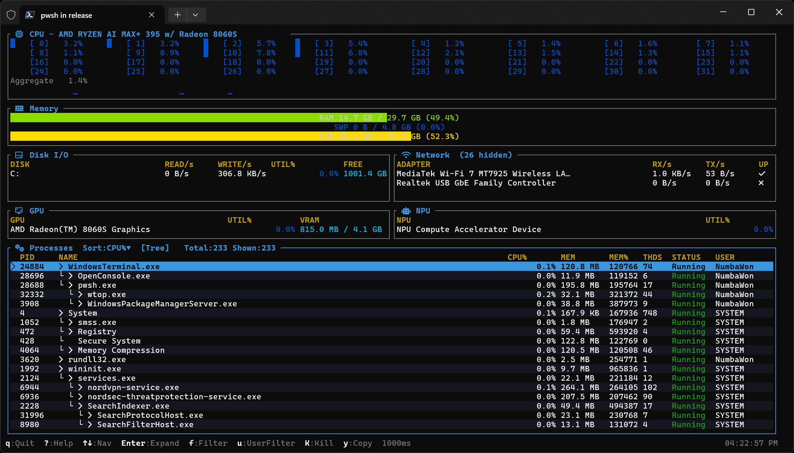
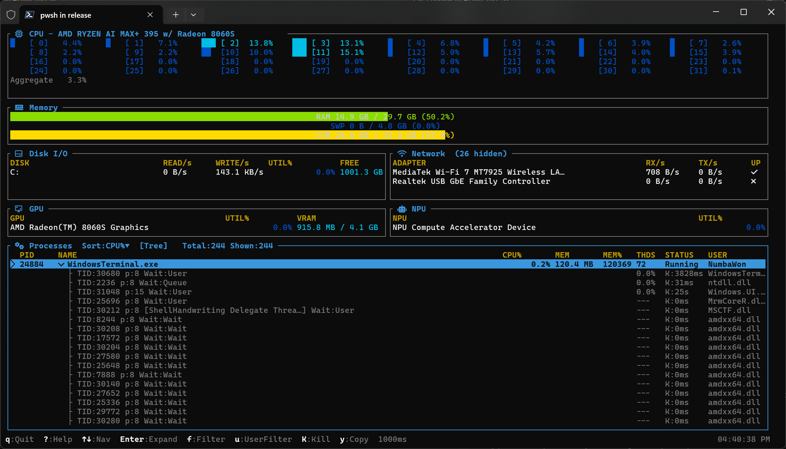
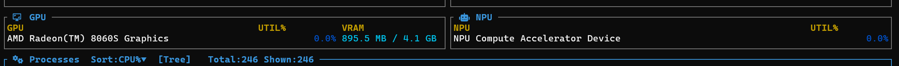
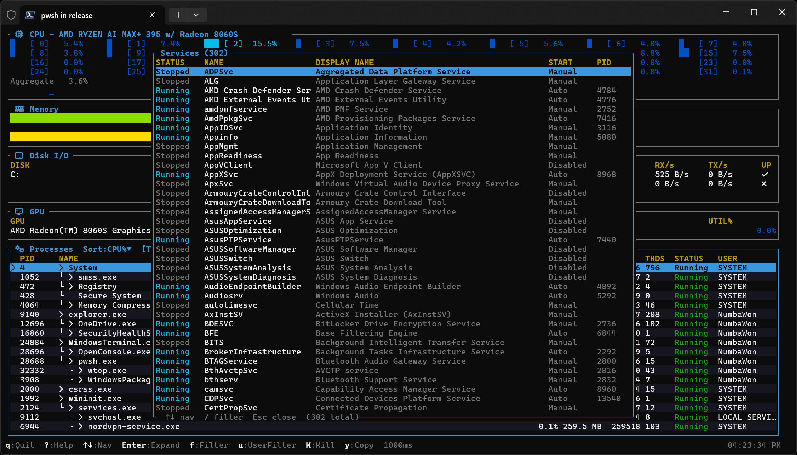
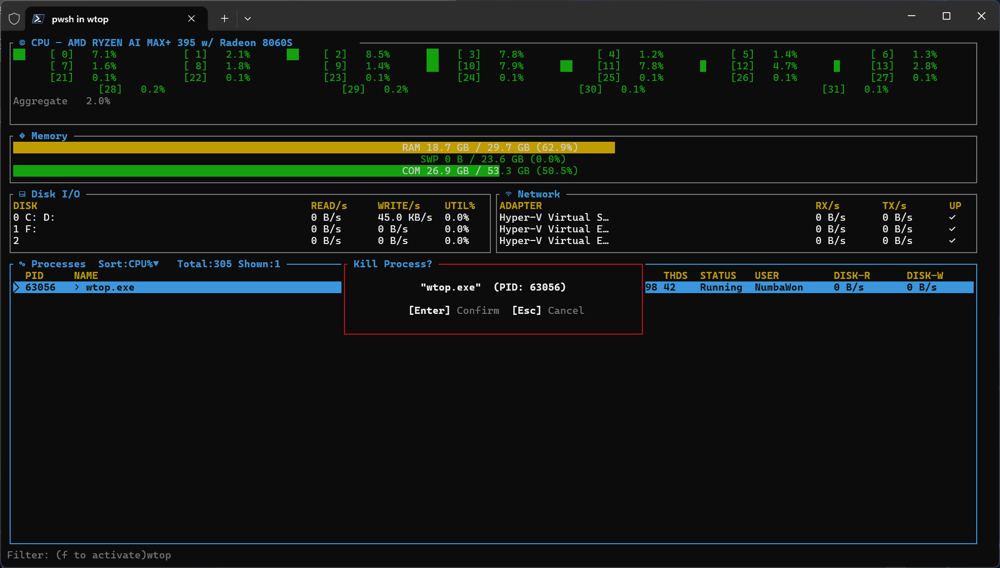
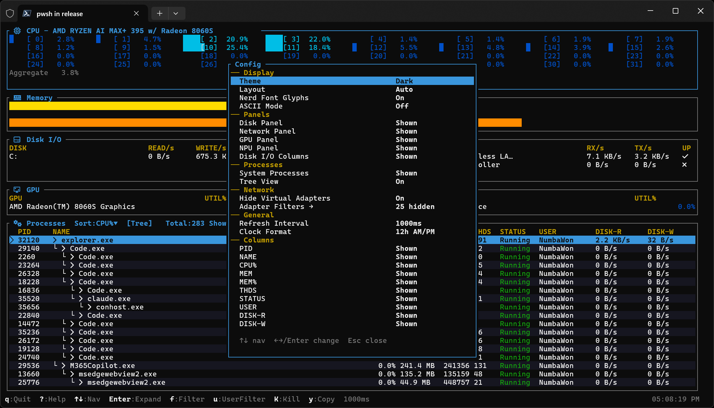
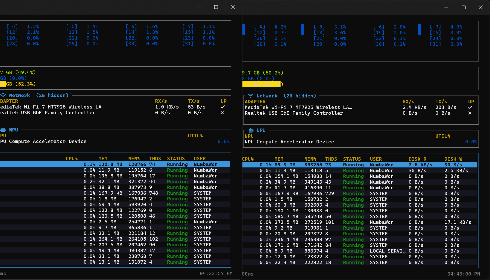
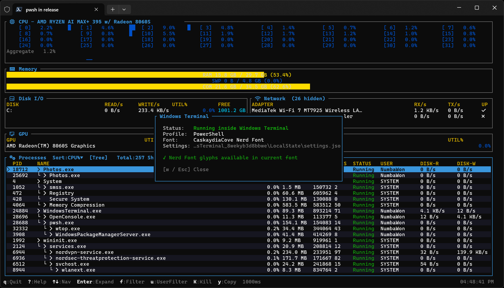

# wtop

<strong>htop for Windows. In your terminal. No install.</strong>

 

 

<!-- screenshot: main — full layout with GPU/NPU panel visible, heat gradient gauges -->

 

Another tool in the belt. When Task Manager is too noisy and Process Explorer isn't installed, this is what you reach for. Already in a terminal - stay there.

 

<h2>What it shows</h2>

| Panel | |
|-------|-|
| **CPU** | Per-core usage bars with aggregate sparkline history |
| **Memory** | RAM and commit charge with sparkline history |
| **Disk** | Read/write bytes per second and utilization sparkline per physical disk |
| **Network** | Rx/Tx per adapter, live |
| **GPU** | Utilization % with sparkline history and VRAM used/total |
| **NPU** | Utilization % with sparkline history (shown alongside GPU when detected) |
| **Processes** | Sortable - CPU%, memory, threads, disk I/O, status, owner |

All gauges use an 8-level heat gradient: **dark blue → cyan → green → yellow → orange → crimson** as load increases.

 

Press <kbd>Enter</kbd> or **double-click** any process to expand it and see its threads inline.

<!-- screenshot: threads_expanded — process with threads expanded showing wait states and module names -->

Each thread shows what it's actually waiting on - `Sleep`, `Mutex`, `LpcReceive`, `Queue`, not just "Waiting". Start address resolves to a module name; anything that doesn't map to a loaded module gets flagged.

 

Press <kbd>i</kbd> on any process to open the **inspect overlay** - a deep-dive panel with six tabs:

| Tab | |
|-----|---|
| **Info** | Exe path, command line, parent, arch, priority, memory, CPU time, mitigations, version info |
| **Threads** | All threads with TID, priority, live CPU%, state, and start module |
| **Modules** | Every loaded DLL with base address, size, and full path |
| **Handles** | Open kernel handles (files, registry keys, events, ...) with force-close |
| **Network** | TCP/UDP connections with local/remote addresses and state |
| **Env** | Environment variables |

Navigate tabs with <kbd>Tab</kbd>. Use <kbd>↑</kbd><kbd>↓</kbd> to move the cursor, <kbd>←</kbd><kbd>→</kbd> to pan wide lines, <kbd>y</kbd> to copy the selected value to the clipboard.

Press <kbd>t</kbd> to toggle **tree view** - processes indent under their parent with `└` connectors, showing the full spawn hierarchy at a glance.

 

<h2>GPU & NPU</h2>

The GPU panel shows each adapter's utilization and VRAM in a compact table with sparkline history. Toggle with <kbd>Shift+G</kbd>.

When an NPU is detected the panel splits 50/50 - GPU on the left, NPU on the right. Detected devices include AMD XDNA, Intel NPU (Meteor Lake "AI Boost"), Qualcomm Hexagon, AMD Ryzen AI, and anything branded "npu" or "neural". AMD XDNA (invisible to DXGI) is found via a supplemental SetupAPI PCI-bus scan at startup.

<!-- screenshot: gpu_npu — GPU/NPU split panel showing utilization sparklines and VRAM -->

 

<h2>Services</h2>

Press <kbd>v</kbd> to open the **services overlay** - a full-screen table of all Windows services with status (color-coded), name, display name, start type, and PID.

Type any letter to filter as you go. <kbd>Backspace</kbd> erases. <kbd>y</kbd> copies the selected service's display name to the clipboard. <kbd>Esc</kbd> closes.

<!-- screenshot: services — services overlay with a filter typed, one row highlighted -->

 

<h2>Mouse</h2>

| Action | |
|--------|---|
| Left-click panel | Focus that panel |
| Left-click column header | Sort by that column; click again to reverse |
| Double-click process row | Expand / collapse threads (same as <kbd>Enter</kbd>) |
| Scroll wheel | Navigate the process list |

 

<h2>Build</h2>

Rust stable, Windows x86-64.

<pre>
cargo build --release
</pre>

One binary - `target\release\wtop.exe`. Copy it wherever.

> **Tip:** Add that directory to your `PATH` so `wtop` is available from any terminal without a full path.

Pre-built binaries are attached to each [GitHub Release](../../releases/latest) if you don't have Rust installed.

<pre>
wtop                                                  # defaults
wtop --interval 500 --theme gruvbox --nerd-glyphs     # faster, themed, with icons
wtop --ascii                                          # basic terminal or CI
</pre>

 

<h2>Options</h2>

| Flag | Default | |
|------|---------|---|
| `-i, --interval <ms>` | `1000` | Refresh rate in ms · 250–5000 |
| `-t, --theme <name>` | `dark` | Color theme slug |
| `--nerd-glyphs` | | Enable Nerd Font icons (auto-detected in Windows Terminal) |
| `--no-nerd-glyphs` | | Force off |
| `--ascii` | | ASCII-only borders and sparklines |
| `--list-themes` | | Print all available themes with author info and exit |
| `--export-themes` | | Re-export built-in themes to the themes directory and exit |
| `--log-level <lvl>` | `warn` | `off` · `error` · `warn` · `info` · `debug` · `trace` |

Logs go to `%TEMP%\wtop.log`.

 

<h2>Keys</h2>

<strong>Navigation</strong>

 

| Key | |
|-----|---|
| <kbd>↑</kbd> / <kbd>↓</kbd> | Move up / down |
| <kbd>PgUp</kbd> / <kbd>PgDn</kbd> | Jump 20 rows |
| <kbd>Home</kbd> / <kbd>End</kbd> | Top / bottom |
| <kbd>Tab</kbd> / <kbd>Shift+Tab</kbd> | Cycle panel focus (skips hidden panels) |
| <kbd>Enter</kbd> | Expand / collapse threads inline |
| <kbd>Ctrl+G</kbd> | Jump to PID |

<strong>Filtering &amp; sorting</strong>

 

| Key | |
|-----|---|
| <kbd>f</kbd> | Open name filter - type to search, <kbd>Esc</kbd> clears then closes |
| <kbd>/</kbd> | Jump to process by partial name |
| <kbd>p</kbd> | Toggle system processes |
| <kbd>u</kbd> | Show only your processes |
| <kbd>s</kbd> / <kbd>Shift+S</kbd> | Next / prev sort column |
| <kbd>r</kbd> | Flip sort order |
| <kbd>t</kbd> | Toggle tree view (parent/child hierarchy) |

<strong>Actions</strong>

 

| Key | |
|-----|---|
| <kbd>i</kbd> | Inspect selected process (6-tab detail overlay) |
| <kbd>Shift+K</kbd> | Kill selected process (asks first) |
| <kbd>y</kbd> | Copy selected process name + PID to clipboard |
| <kbd>v</kbd> | Open services overlay |
| <kbd>+</kbd> / <kbd>-</kbd> | Faster / slower refresh |
| <kbd>q</kbd> / <kbd>Ctrl+C</kbd> | Quit |

<strong>Inspect overlay</strong>

 

Open with <kbd>i</kbd>, close with <kbd>i</kbd> or <kbd>Esc</kbd>.

| Key | |
|-----|---|
| <kbd>Tab</kbd> | Switch tab (Info / Threads / Modules / Handles / Network / Env) |
| <kbd>↑</kbd> / <kbd>↓</kbd> | Move cursor |
| <kbd>PgUp</kbd> / <kbd>PgDn</kbd> | Jump 10 rows |
| <kbd>←</kbd> / <kbd>→</kbd> | Pan wide lines left / right |
| <kbd>y</kbd> | Copy selected value to clipboard |
| <kbd>x</kbd> | Force-close selected handle (Handles tab) |

<strong>Services overlay</strong>

 

Open with <kbd>v</kbd>, close with <kbd>v</kbd> or <kbd>Esc</kbd>.

| Key | |
|-----|---|
| <kbd>↑</kbd> / <kbd>↓</kbd> | Move cursor |
| <kbd>PgUp</kbd> / <kbd>PgDn</kbd> | Jump 10 rows |
| Any letter | Filter by name / display name |
| <kbd>Backspace</kbd> | Erase filter |
| <kbd>Delete</kbd> | Clear filter |
| <kbd>y</kbd> | Copy selected display name to clipboard |

<strong>Display</strong>

 

| Key | |
|-----|---|
| <kbd>Shift+L</kbd> | Cycle layout |
| <kbd>Shift+T</kbd> | Cycle theme |
| <kbd>d</kbd> | Toggle disk panel |
| <kbd>n</kbd> | Toggle network panel |
| <kbd>Shift+G</kbd> | Toggle GPU panel |
| <kbd>c</kbd> | Toggle disk I/O columns |
| <kbd>g</kbd> | Toggle Nerd Font glyphs |
| <kbd>C</kbd> | Settings panel |
| <kbd>w</kbd> | Windows Terminal panel |
| <kbd>?</kbd> / <kbd>h</kbd> | Help overlay |

 

<!-- screenshot: filter_kill — filter bar active + kill confirm dialog -->

 

<h2>Settings</h2>

Press <kbd>C</kbd> to open the settings panel. All options that have a dedicated key also live here, plus column visibility toggles.

<!-- screenshot: settings — settings panel open showing all sections -->

 

<h2>Themes</h2>

`--theme <name>` at launch, or cycle at runtime with <kbd>Shift+T</kbd>.

`dark` · `light` · `catppuccin_mocha` · `cyberpunk` · `dracula` · `gruvbox` · `monokai` · `nord` · `one_dark` · `solarized_dark` · `tokyo_night`

Themes are TOML files in `%APPDATA%\wtop\themes\`. Built-ins are exported there on first launch - copy and edit to make your own. Drop any `.toml` in the directory and it appears in the cycle immediately, live-reloaded as you edit. See [`themes/README.md`](themes/README.md) for the full schema.

<!-- screenshot: themes — animated or side-by-side showing several themes -->

 

<h2>Layouts</h2>

Cycle with <kbd>Shift+L</kbd>.

| | |
|-|-|
| **Auto** | Wide if the terminal is wide enough, compact otherwise |
| **Wide** | All panels side by side above the process list |
| **Compact** | Panels stacked left, process list right |
| **Stacked** | Single column - process list gets the most room |

<!-- screenshot: layouts — side-by-side showing wide vs compact vs stacked -->

 

<h2>Windows Terminal</h2>

Press <kbd>w</kbd> to open the WT panel. If you haven't set a Nerd Font yet, wtop can write the setting - press <kbd>f</kbd>, confirm, restart WT.

<!-- screenshot: wt_panel — Windows Terminal info panel -->

 

<h2>License</h2>

MIT
